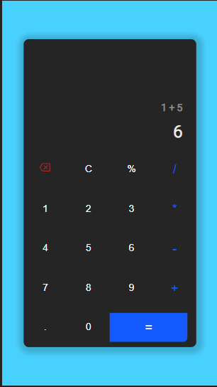
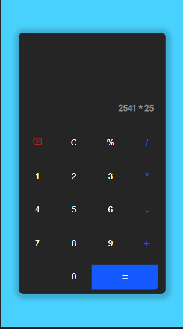
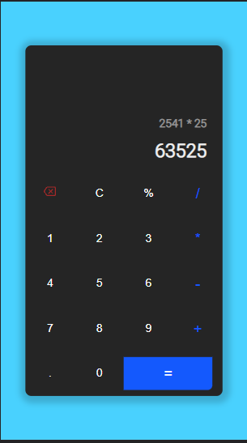

<h1 align='center'>
    Calculadora minimalista desenvolvida com Reactjs.
</h1>

# 🤔 Sobre

Calculadora feita com React.

# 💻 Tecnologias utilizadas

- [HTML5](https://developer.mozilla.org/pt-BR/docs/Web/HTML/HTML5)
- [CSS3](https://www.w3.org/Style/CSS/Overview.en.html)
- [JavaScript](https://www.javascript.com/)
- [ReactJS](https://reactjs.org/)

## 🧐 Preview  

## 👉 Teste em: https://gabrielduete.github.io/calculadora-React/
